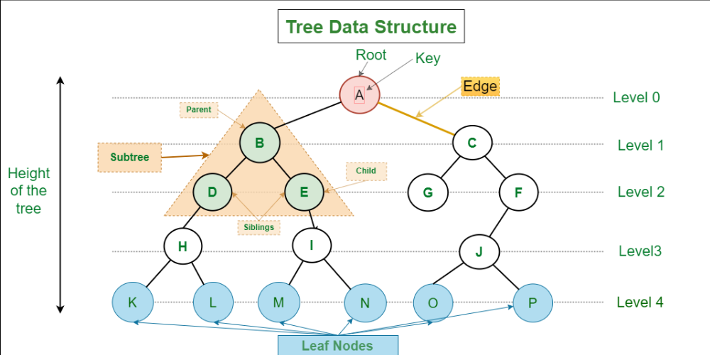

- [Data Structures](#data-structures)
  - [Arrays](#arrays)
  - [Singly Linked Lists](#singly-linked-lists)
  - [Doubly-Linked Lists](#doubly-linked-lists)
  - [Circular Linked Lists](#circular-linked-lists)
  - [Stacks](#stacks)
  - [Queues](#queues)
  - [Hash Tables](#hash-tables)
  - [Trees](#trees)
  - [Graphs](#graphs)

## Data Structures

A data structure is a way of organizing and storing data in a computer so that it can be accessed and manipulated efficiently. It defines the relationship between the data elements and enables operations to be performed on the data. Common data structures include arrays, linked lists, trees, and graphs.

### Arrays

**Definition**

An array is a collection of elements, all of the same data type, stored at contiguous memory locations. Each element in an array is identified by an index or a key. Arrays are efficient for storing and accessing data, making the versatility one of its main characteristics.

**Representation**


**Advantages**

- **Fast Access Time:** Elements in an array can be accessed directly using their index, which allows for constant-time access. This means accessing any element in the array takes the same amount of time regardless of the size of the array.
- **Simplicity:** Arrays are simple and intuitive to use. They provide a straightforward way to store and retrieve data, making them easy to understand and implement.
- **Memory Efficiency:** Arrays have a contiguous memory allocation, which means they use memory efficiently. There is no overhead for storing pointers or references to other elements, as elements are stored sequentially in memory.
- **Cache Locality:** Due to contiguous memory storage, arrays exhibit good cache locality. Accessing elements that are close to each other in memory can utilize CPU caches effectively, improving performance.
- **Predictable Performance:** Array operations have predictable time complexity for accessing elements, making them suitable for applications where predictable performance is crucial.

**Disadvantages:**

- **Fixed Size:** Arrays have a fixed size, meaning you need to specify the number of elements when you create them. Changing the size of an array (resizing) is often a costly operation, especially if the array is full, as it may require allocating a new, larger array and copying all elements.
- **Inefficient Insertions and Deletions:** Inserting or deleting elements in the middle of an array requires shifting elements, which can be computationally expensive, especially for large arrays. This operation has a time complexity of O(n), where n is the number of elements in the array.
- **Wasted Space:** If the size of the array is larger than the number of elements it holds, there can be wasted memory space, especially if the array size is fixed and larger than necessary.
- **Lack of Flexibility:** Arrays are not dynamic by default, meaning they cannot easily change in size at runtime. To work around this limitation, dynamic arrays (like ArrayList in Java or vectors in C++) or other data structures like linked lists are often used.
- **Non-Primitive Data Types:** In many programming languages, arrays can only store elements of the same data type. This limitation can be overcome by using arrays of objects or pointers, but it adds complexity to the code.

**Use-Cases:**

**Storing and Manipulating Lists of Data:**

Arrays are widely used to store lists of data in JavaScript. For example, you can use an array to store a list of names, numbers, or any other type of data. You can easily add, remove, or modify elements in the array. For instance:

```javascript
// Storing a list of names in an array
let names = ["Alice", "Bob", "Charlie", "David"];

// Adding a new name to the array
names.push("Eva");

// Removing a name from the array
names.splice(2, 1); // Removes "Charlie" from the array

// Modifying an element in the array
names[1] = "Betty"; // Changes "Bob" to "Betty"
```

**Iterating and Processing Data:**
Arrays are perfect for iterating over elements and performing operations on each element. You can use loops like `for` or array methods like `forEach`, `map`, `filter`, and `reduce` to process the elements in an array. For example:

```javascript
// Calculating the sum of numbers in an array
let numbers = [1, 2, 3, 4, 5];
let sum = 0;

for (let i = 0; i < numbers.length; i++) {
  sum += numbers[i];
}

// Using array methods to calculate the sum
let sumUsingReduce = numbers.reduce((acc, current) => acc + current, 0);
```

**Implementing Data Structures and Algorithms:**

Arrays are fundamental for implementing various data structures like stacks, queues, and hash tables, as well as algorithms such as sorting and searching. For example, you can use an array as a stack by adding elements to the end and removing them from the end, implementing a Last In, First Out (LIFO) behavior. Similarly, you can use an array as a queue by adding elements to the end and removing them from the beginning, implementing a First In, First Out (FIFO) behavior.

```javascript
// Implementing a stack using an array
let stack = [];
stack.push(1); // Pushing an element onto the stack
let topElement = stack.pop(); // Popping an element from the stack

// Implementing a queue using an array
let queue = [];
queue.push(1); // Enqueue an element
let dequeuedElement = queue.shift(); // Dequeue an element
```

> In computer programming, arrays can be categorized as static or dynamic based on their size flexibility. Static arrays have a fixed size, determined at the time of declaration, while dynamic arrays can resize themselves to accommodate varying numbers of elements.
>
> When a dynamic array becomes full, it needs to resize itself to accommodate additional elements. A common resizing strategy involves doubling the array's size. However, this doubling strategy comes with a cost: copying all existing elements from the old array to a new, larger array in a different memory location. This copying operation ensures that there is enough contiguous space in memory to store the expanded array.

**Problem Scenarios:**


| Problem Scenario                              | Description                                                                                              |
| ----------------------------------------------- | ---------------------------------------------------------------------------------------------------------- |
| Finding the sum of a sequence of numbers      | Efficiently store a sequence of numbers in an ordered structure for easy access and summation.           |
| Sorting a list of elements                    | Utilize the direct access property of arrays for efficient sorting algorithms.                           |
| Searching for a specific element in a list    | Leverage the direct access capability of arrays for efficient element retrieval.                         |
| Maintaining a collection of student records   | Store student records in an array to facilitate easy access and manipulation.                            |
| Handling a set of unique names or IDs         | Effectively manage a collection of unique identifiers using the constant-time access property of arrays. |
| Processing a list of strings                  | Utilize arrays for the sequential manipulation of lists of strings.                                      |
| Calculating cumulative or running averages    | Use arrays for maintaining cumulative sums, enabling the efficient calculation of running averages.      |
| Implementing a stack or a queue               | Employ arrays to implement fundamental data structures like stacks or queues.                            |
| Tracking frequencies of elements in a dataset | Leverage arrays for counting and tracking element frequencies, creating a histogram.                     |
| Applying the sliding window technique         | Play a crucial role in implementing the sliding window technique for efficient subset maintenance.       |

---

### Singly Linked Lists

**Definition**

A linear data structure where elements are stored in nodes, and each node points to the next element in the list. The **Singly Linked List**, a data structure where each element (node) contains data and a reference to the next element in a unidirectional sequence.

**Representation**


**Advantages**

- **Simple Implementation:** Singly linked lists are relatively simple to implement, making them easy to understand and use.
- **Memory Efficiency:** Singly linked lists are memory-efficient compared to doubly linked lists as they only require one pointer per node.
- **Dynamic Size:** Singly linked lists can easily adjust their size, allowing for dynamic addition or removal of elements without the need for pre-allocated memory.
- **Ease of Insertion and Deletion:** Inserting or deleting elements at the beginning of a singly linked list is a constant-time operation, making these operations efficient.
- **Straightforward Traversal::** Traversing a singly linked list is straightforward, moving from one node to the next using the next pointers.

**Disadvantages:**

- **Limited Traversal Options:** Singly linked lists only support forward traversal, which can be a limitation in certain scenarios where backward traversal is necessary.
- **Inefficient Reverse Traversal:** Reversing a singly linked list is inefficient and often requires additional data structures or operations.
- **No Direct Access to Previous Node:** Accessing the previous node in a singly linked list requires traversing from the beginning of the list, leading to inefficiencies.
- **Memory Overhead for Large Lists:** In large singly linked lists, the memory overhead of storing next pointers for each node can become significant.
- **Limited Operations on Tail:** Performing operations at the end of a singly linked list, such as finding the tail or deleting the last node, can be less efficient compared to operations at the beginning.

**Use-Cases:**

**Symbol Table in a Compiler:**

Building a symbol table in a compiler, where identifiers and their associated information are stored dynamically.

```javascript
class SymbolEntry {
  constructor(identifier, type) {
    this.identifier = identifier;
    this.type = type;
    this.next = null;
  }
}

class SymbolTable {
  constructor() {
    this.head = null;
  }

  addSymbol(identifier, type) {
    const newSymbol = new SymbolEntry(identifier, type);
    newSymbol.next = this.head;
    this.head = newSymbol;
  }

  findSymbol(identifier) {
    let current = this.head;

    while (current !== null) {
      if (current.identifier === identifier) {
        return current.type;
      }
      current = current.next;
    }

    return null; // Symbol not found
  }
}

// Example Usage:
const symbolTable = new SymbolTable();
symbolTable.addSymbol("variable1", "int");
symbolTable.addSymbol("variable2", "float");
console.log(symbolTable.findSymbol("variable1")); // Output: int
```

**Problem Scenarios:**


| Problem Scenario                              | Description                                                                                                                    |
| ----------------------------------------------- | -------------------------------------------------------------------------------------------------------------------------------- |
| Reversing a singly linked list                | Implement an algorithm to reverse the direction of a singly linked list, changing the order of elements.                       |
| Detecting a cycle in a singly linked list     | Identify whether a singly linked list contains a cycle by using fast and slow pointers to traverse the list.                   |
| Finding the middle element of a linked list   | Determine the middle element of a singly linked list efficiently using a two-pointer approach.                                 |
| Removing duplicates from a linked list        | Eliminate duplicate elements from a singly linked list to maintain a unique set of values.                                     |
| Merging two sorted linked lists               | Merge two sorted singly linked lists into a single sorted list, considering the order of elements in both lists.               |
| Detecting the intersection point of two lists | Identify the node at which two singly linked lists intersect, if they do, using a set or two-pointer approach.                 |
| Swapping nodes in pairs in a linked list      | Rearrange elements in a singly linked list by swapping nodes in pairs to change the order of adjacent elements.                |
| Checking if a linked list is a palindrome     | Determine whether a singly linked list is a palindrome, meaning it reads the same forward and backward.                        |
| Implementing a stack using a linked list      | Utilize a singly linked list to implement a stack, maintaining the Last-In-First-Out (LIFO) property for efficient operations. |
| Flattening a multilevel linked list           | Flatten a multilevel (nested) singly linked list, transforming it into a single-level list for easier traversal and analysis.  |

---

### Doubly-Linked Lists

**Definition**

Doubly linked lists are a type of linked list where each node contains a data element and two pointers, one pointing to the next node in the sequence (next pointer) and another pointing to the previous node (previous pointer). This bidirectional linkage allows for more flexible traversal and manipulation compared to singly linked lists.

**Representation**


**Advantages:**

- **Bidirectional Traversal:** Doubly linked lists support bidirectional traversal, allowing efficient movement in both forward and backward directions.

**Efficient Deletion:** Deleting a node in a doubly linked list is more efficient than in a singly linked list because the previous node's pointer is readily available.

**Reverse Traversal:** Reversing a doubly linked list is more efficient than in a singly linked list because each node has a pointer to its previous node.

**Dynamic Size with Tail Pointer:** A doubly linked list with a tail pointer allows for dynamic addition or removal of elements at both the beginning and end in constant time.

**Easier Implementation of Certain Algorithms:** Certain algorithms, such as reversing a linked list or detecting a palindrome, can be implemented more efficiently with a doubly linked list.

**Disadvantages:**

**Increased Memory Usage:** Doubly linked lists use more memory compared to singly linked lists because each node requires two pointers (next and previous).

**Complex Implementation:** Implementing and maintaining doubly linked lists is more complex than singly linked lists, leading to potentially more error-prone code.

**Memory Overhead for Large Lists:** In large doubly linked lists, the memory overhead of storing both next and previous pointers for each node can become significant.

**Limited Operations on Tail:** Although operations at the tail are more efficient than in a singly linked list, they are still less efficient than operations at the head.

**Increased Complexity for Certain Operations:** Some operations, such as insertion in the middle of the list, can be more complex and may require careful handling of multiple pointers.

**Use-Cases:**

**Dynamic Task List:**
Managing a dynamic list of tasks with the ability to easily add or remove tasks.

```javascript
class Task {
  constructor(description) {
    this.description = description;
    this.next = null;
  }
}

class TaskList {
  constructor() {
    this.head = null;
  }

  addTask(description) {
    const newTask = new Task(description);
    newTask.next = this.head;
    this.head = newTask;
  }

  removeTask(description) {
    let current = this.head;
    let prev = null;

    while (current !== null) {
      if (current.description === description) {
        if (prev === null) {
          this.head = current.next;
        } else {
          prev.next = current.next;
        }
        return;
      }

      prev = current;
      current = current.next;
    }
  }
}

// Example Usage:
const tasks = new TaskList();
tasks.addTask("Complete assignment");
tasks.addTask("Read a book");
tasks.removeTask("Read a book");
```

**Undo/Redo Functionality:**

Implementing undo/redo functionality in applications where users can perform actions and revert them.

```javascript
class State {
  constructor(data, prevState = null) {
    this.data = data;
    this.prevState = prevState;
  }
}

class StateHistory {
  constructor() {
    this.currentState = null;
  }

  pushState(data) {
    this.currentState = new State(data, this.currentState);
  }

  undo() {
    if (this.currentState !== null) {
      this.currentState = this.currentState.prevState;
    }
  }

  getCurrentState() {
    return this.currentState ? this.currentState.data : null;
  }
}

// Example Usage:
const history = new StateHistory();
history.pushState("Initial State");
history.pushState("Updated State");
history.undo();
console.log(history.getCurrentState()); // Output: Initial State
```

**Symbol Table in a Compiler:**

Building a symbol table in a compiler, where identifiers and their associated information are stored dynamically.

```javascript
class SymbolEntry {
  constructor(identifier, type) {
    this.identifier = identifier;
    this.type = type;
    this.next = null;
  }
}

class SymbolTable {
  constructor() {
    this.head = null;
  }

  addSymbol(identifier, type) {
    const newSymbol = new SymbolEntry(identifier, type);
    newSymbol.next = this.head;
    this.head = newSymbol;
  }

  findSymbol(identifier) {
    let current = this.head;

    while (current !== null) {
      if (current.identifier === identifier) {
        return current.type;
      }
      current = current.next;
    }

    return null; // Symbol not found
  }
}

// Example Usage:
const symbolTable = new SymbolTable();
symbolTable.addSymbol("variable1", "int");
symbolTable.addSymbol("variable2", "float");
console.log(symbolTable.findSymbol("variable1")); // Output: int
```

---

### Circular Linked Lists

**Definition**

A circular linked list is a type of linked list where the last node of the list points back to the first node, creating a circle or loop in the sequence. Circular linked lists can be either **singly or doubly linked**, similar to their linear counterparts, but with the added feature of circular connectivity.

**Representation**

The representation of a circular linked list is similar to that of a linear linked list, with the last node connecting back to the first node. Here's a simplified diagram:


For a doubly circular linked list, each node will have both next and previous pointers, forming a circular doubly linked structure.

**Advantages**

* **Efficient Circular Operations:** Circular linked lists can be beneficial for scenarios where circular operations are required, such as in rotating buffers or circular queues.
* **Easier Implementation of Circular Structures:** When dealing with problems that involve a circular or periodic nature, a circular linked list can provide a more natural representation of the data.

**Disadvantages**

* **Increased Complexity:** Circular linked lists can be more complex to implement and manipulate compared to linear linked lists.
* **Potential for Infinite Loops:** If not managed properly, circular linked lists can result in infinite loops during traversal if there are issues with pointers or termination conditions.

**Use-Cases**

**Round-Robin Scheduling in Operating Systems:**

In round-robin scheduling, processes are assigned time slices in a circular order. A circular linked list can be used to represent the queue of processes, and each time a process completes its time slice, it moves to the end of the queue.

<pre><div class="bg-black rounded-md"><div class="p-4 overflow-y-auto"><code class="!whitespace-pre hljs language-javascript"><span class="hljs-keyword">class</span> <span class="hljs-title class_">Process</span> {
  <span class="hljs-title function_">constructor</span>(<span class="hljs-params">id</span>) {
    <span class="hljs-variable language_">this</span>.<span class="hljs-property">id</span> = id;
    <span class="hljs-variable language_">this</span>.<span class="hljs-property">next</span> = <span class="hljs-literal">null</span>;
  }
}

<span class="hljs-keyword">class</span> <span class="hljs-title class_">RoundRobinScheduler</span> {
  <span class="hljs-title function_">constructor</span>(<span class="hljs-params"></span>) {
    <span class="hljs-variable language_">this</span>.<span class="hljs-property">head</span> = <span class="hljs-literal">null</span>;
    <span class="hljs-variable language_">this</span>.<span class="hljs-property">currentProcess</span> = <span class="hljs-literal">null</span>;
  }

  <span class="hljs-title function_">addProcess</span>(<span class="hljs-params">id</span>) {
    <span class="hljs-keyword">const</span> newProcess = <span class="hljs-keyword">new</span> <span class="hljs-title class_">Process</span>(id);

    <span class="hljs-keyword">if</span> (!<span class="hljs-variable language_">this</span>.<span class="hljs-property">head</span>) {
      <span class="hljs-variable language_">this</span>.<span class="hljs-property">head</span> = newProcess;
      <span class="hljs-variable language_">this</span>.<span class="hljs-property">head</span>.<span class="hljs-property">next</span> = <span class="hljs-variable language_">this</span>.<span class="hljs-property">head</span>; <span class="hljs-comment">// Circular reference</span>
      <span class="hljs-variable language_">this</span>.<span class="hljs-property">currentProcess</span> = <span class="hljs-variable language_">this</span>.<span class="hljs-property">head</span>;
    } <span class="hljs-keyword">else</span> {
      newProcess.<span class="hljs-property">next</span> = <span class="hljs-variable language_">this</span>.<span class="hljs-property">head</span>.<span class="hljs-property">next</span>;
      <span class="hljs-variable language_">this</span>.<span class="hljs-property">head</span>.<span class="hljs-property">next</span> = newProcess;
    }
  }

  <span class="hljs-title function_">getNextProcess</span>(<span class="hljs-params"></span>) {
    <span class="hljs-variable language_">this</span>.<span class="hljs-property">currentProcess</span> = <span class="hljs-variable language_">this</span>.<span class="hljs-property">currentProcess</span>.<span class="hljs-property">next</span>;
    <span class="hljs-keyword">return</span> <span class="hljs-variable language_">this</span>.<span class="hljs-property">currentProcess</span>.<span class="hljs-property">id</span>;
  }
}

<span class="hljs-comment">// Example Usage:</span>
<span class="hljs-keyword">const</span> scheduler = <span class="hljs-keyword">new</span> <span class="hljs-title class_">RoundRobinScheduler</span>();
scheduler.<span class="hljs-title function_">addProcess</span>(<span class="hljs-number">1</span>);
scheduler.<span class="hljs-title function_">addProcess</span>(<span class="hljs-number">2</span>);
scheduler.<span class="hljs-title function_">addProcess</span>(<span class="hljs-number">3</span>);

<span class="hljs-variable language_">console</span>.<span class="hljs-title function_">log</span>(scheduler.<span class="hljs-title function_">getNextProcess</span>()); <span class="hljs-comment">// Output: 1</span>
<span class="hljs-variable language_">console</span>.<span class="hljs-title function_">log</span>(scheduler.<span class="hljs-title function_">getNextProcess</span>()); <span class="hljs-comment">// Output: 2</span>
<span class="hljs-variable language_">console</span>.<span class="hljs-title function_">log</span>(scheduler.<span class="hljs-title function_">getNextProcess</span>()); <span class="hljs-comment">// Output: 3</span>
<span class="hljs-variable language_">console</span>.<span class="hljs-title function_">log</span>(scheduler.<span class="hljs-title function_">getNextProcess</span>()); <span class="hljs-comment">// Output: 1</span>
</code></div></div></pre>

**Problem Scenarios:**


| Problem Scenario                                 | Description                                                                                                                |
| -------------------------------------------------- | ---------------------------------------------------------------------------------------------------------------------------- |
| Detecting a cycle in a circular linked list      | Determine whether a circular linked list contains a cycle by using fast and slow pointers to traverse the list.            |
| Finding the starting point of the cycle          | Identify the node where a cycle starts in a circular linked list, often referred to as the "tortoise and hare" algorithm.  |
| Converting a circular linked list to linear      | Transform a circular linked list into a linear linked list while maintaining the order of elements.                        |
| Josephus Problem                                 | Solve the Josephus problem, where every k-th person is eliminated from a circle of n people until only one person remains. |
| Splitting a circular linked list into two halves | Divide a circular linked list into two halves, enabling further operations such as merging or sorting.                     |

Circular linked lists introduce additional complexities compared to linear linked lists, and their use-cases often involve scenarios where circular relationships or circular operations are essential.

---

### Stacks

**Definition**

A stack is a linear data structure that follows the Last In, First Out (LIFO) principle, where elements are added and removed from the same end, typically referred to as the "top." New elements are pushed onto the top, and only the top element can be popped or accessed at any given time.

**Representation**


**Advantages**

- **Simple Implementation:** Stacks are simple to implement, making them easy to understand and use.
- **Efficient Push and Pop Operations:** Adding and removing elements from the top of the stack (push and pop operations) have constant time complexity.
- **Space Efficiency:** Stacks can be more memory-efficient than dynamic data structures like linked lists because they have a fixed size.
- **Support for Undo Mechanism:** Stacks are commonly used to implement undo mechanisms in software applications.
- **Function Call Management:** Stacks are used in programming languages to manage function calls and store local variables.

**Disadvantages:**

- **Limited Access:** Stacks offer limited access to elements. Only the top element can be directly accessed.
- **Fixed Size:** Traditional stacks have a fixed size, and resizing can be challenging, leading to potential overflow or underflow issues.
- **Not Suitable for Random Access:** Stacks are not suitable for scenarios where random access to elements is required.
- **Memory Management Overhead:** Stacks may have memory management overhead due to their fixed size, even if the stack is not full.
- **Limited Applicability:** Stacks are best suited for specific scenarios like managing function calls or undo mechanisms and may not be the most efficient choice for other data access patterns

**Use-Cases:**

- **Function Call Management:** Stacks play a crucial role in managing function calls in programming languages. Each time a function is called, its local variables and execution context are pushed onto the stack, and when the function returns, this context is popped.
- **Undo Mechanisms in Applications:** The ability to undo actions is a common and essential feature in many applications. Stacks are used to keep track of user actions, allowing for efficient undo functionality by simply popping the most recent action from the stack.
- **Expression Evaluation (Postfix/Prefix Notation):** Stacks are fundamental for evaluating expressions in postfix or prefix notation. As operands and operators are encountered, they are pushed or popped from the stack, facilitating efficient evaluation.
- **Browser Back Button:** Web browsers use stacks to implement the back button functionality. Each visited page is pushed onto the stack, and pressing the back button pops the most recently visited page, navigating the user through their browsing history.
- **Parsing and Syntax Checking:** Stacks are crucial in parsing and syntax checking during the compilation of programming languages. They help ensure that the syntax of the code is correct by keeping track of nested symbols such as parentheses and braces.

---

### Queues

**Definition**

A queue is a linear data structure that follows the First In, First Out (FIFO) principle, where elements are added at the rear and removed from the front. It operates like a waiting line, ensuring that the first element enqueued is the first to be dequeued.

**Representation**


**Advantages**

- **Efficient Enqueue and Dequeue Operations:** Adding and removing elements from the front and rear of the queue (enqueue and dequeue operations) have constant time complexity in well-implemented queues.
- **FIFO Order:** Queues follow the First In, First Out (FIFO) principle, ensuring that elements are processed in the order they were added.
- **Memory Efficiency:** Queues can be more memory-efficient than dynamic data structures like linked lists because they have a fixed size.
- **Task Scheduling:** Queues are commonly used in task scheduling and management systems, ensuring tasks are processed in a fair order.
- **Buffering:** Queues are employed in scenarios where data needs to be buffered or smoothed out, such as in communication systems.

**Disadvantages:**

- **Limited Access:** Queues offer limited access to elements. Only the front and rear elements can be directly accessed.
- **Fixed Size:** Traditional queues have a fixed size, and resizing can be challenging, leading to potential overflow or underflow issues.
- **Not Suitable for Random Access:** Queues are not suitable for scenarios where random access to elements is required.
- **Memory Management Overhead:** Queues may have memory management overhead due to their fixed size, even if the queue is not full.
- **Limited Applicability:** Queues are best suited for specific scenarios like task scheduling or buffering and may not be the most efficient choice for other data access patterns.

**Use-Cases:**

* **Job Scheduling:** Queues are commonly used in job scheduling systems. They facilitate the orderly processing of jobs or tasks, where each job is processed in the order it was added, following a First In, First Out (FIFO) order.
* **Breadth-First Search (BFS) in Graphs:** BFS traversal of graphs is often implemented using a queue. Nodes are enqueued and explored level by level, ensuring that nodes at the same level are processed before moving on to the next level.
* **Print Queue in Operating Systems:** Operating systems manage print jobs using queues. Print requests are enqueued, and the system processes them in the order they are received, providing fair and orderly printing.
* **Task Processing in Concurrent Systems:** Queues are employed in concurrent programming to manage tasks among multiple threads or processes. Tasks are enqueued, and worker threads or processes dequeue and execute them, providing a mechanism for load balancing.
* **Message Queues in Communication Systems:** In distributed systems, message queues facilitate communication between different components or services. Producers enqueue messages, and consumers dequeue and process them asynchronously, enabling reliable communication.

---

### Hash Tables

**Definition**

A data structure that stores **key-value pairs** and uses a **hash function** to compute an index into an array where the corresponding value can be found. A hash table is a data structure that implements an associative array abstract data type, providing efficient access and storage of key-value pairs through a hash function. It enables rapid lookup, insertion, and deletion operations with average-case constant time complexity.

**Representation**


**Advantages**

- **Fast Lookup:** Hash tables offer fast average-case lookup times, providing constant-time or near-constant-time access to stored elements.
- **Efficient Insertion and Deletion:** Inserting and deleting elements in a well-designed hash table can also be performed in constant time on average.
- **Adaptability to Dynamic Data:** Hash tables can dynamically adjust to changing data sizes without a significant increase in average-case time complexity.
- **Effective for Search Operations:** Hash tables are highly effective for search operations when the key is known, making them suitable for applications like databases and caches.
- **Optimized Memory Usage:** When designed well, hash tables can offer optimized memory usage, reducing the likelihood of collisions.

**Disadvantages:**

- **Potential for Collisions:** Hash collisions can occur when two different keys produce the same hash value, requiring additional handling mechanisms like chaining or open addressing.
- **Hash Function Dependency:** The efficiency of a hash table relies heavily on the quality of the hash function, and a poor hash function may lead to increased collisions.
- **Unordered Output:** The ordering of elements in a hash table is not deterministic and does not follow a specific order, making it unsuitable for scenarios requiring ordered traversal.
- **Complexity of Implementation:** Designing an efficient and collision-resistant hash table can be complex, requiring careful consideration of the hash function, collision resolution strategy, and load factor.
- **Space Overhead:** Hash tables may have a space overhead due to potential unused slots and the need for additional data structures to handle collisions.

**Use-Cases:**

---

### Trees

**Definition**

A tree is a hierarchical data structure composed of **nodes**, where each node contains a value and may have **zero or more child nodes**, forming a branching structure. The topmost node in a tree is called the **root**, and nodes with no children are called **leaves**. Nodes in a tree are connected by **edges**, and the relationship between nodes reflects a hierarchical arrangement. Trees are widely used in computer science for representing hierarchical relationships, organizing data, and supporting various algorithms and data storage structures.

**Representation**



**Advantages**

- **Hierarchical Organization:** Trees provide a hierarchical structure, allowing for the representation of parent-child relationships among elements.
- **Efficient Search Operations:** Binary search trees, in particular, enable efficient search operations with average-case logarithmic time complexity.
- **Natural Representation of Hierarchies:** Trees naturally represent hierarchical relationships, making them suitable for modeling organizational structures, file systems, and other hierarchical entities.
- **Efficient Insertion and Deletion:** Balanced trees, such as AVL trees and Red-Black trees, offer efficient insertion and deletion operations with logarithmic time complexity.
- **Versatility in Applications:** Trees are versatile and find applications in various domains, including databases, expression evaluation, decision-making processes, and network routing algorithms.

**Disadvantages:**

- **Complexity of Implementation:** Designing and implementing certain types of trees, especially balanced ones, can be complex and may require careful consideration of balancing criteria.
- **Potential for Skewed Trees:** Unbalanced trees can lead to performance degradation, particularly in search operations, with worst-case linear time complexity.
- **Memory Overhead:** Trees may have a memory overhead due to the storage of additional pointers or metadata for maintaining the hierarchical structure.
- **Difficulty in Ordered Traversal:** Some types of trees, like general trees, do not provide a natural ordering of elements, making ordered traversal challenging.
- **Limited Applicability for Unrelated Data:** Trees are most effective when representing hierarchical relationships, and their use may be less intuitive for representing unrelated or non-hierarchical data.

**Use-Cases:**

---

### Graphs

**Definition**

Graphs are a fundamental data structure in computer science and mathematics. They consist of a collection of **nodes (vertices)** and **edges **that connect pairs of nodes. The connections between nodes represent relationships or interactions between the associated entities.

**Representation**


**Advantages:**

- **Versatility:** Graphs provide a versatile way to represent and model various relationships, from social networks and transportation systems to computer networks and dependencies in software.
- **Efficient Representation:** Certain relationships, such as connectivity or pairwise interactions, can be efficiently represented and analyzed using graph structures.
- **Traversal and Pathfinding:** Graph algorithms, such as depth-first search (DFS) and breadth-first search (BFS), are effective for traversing and finding paths in a graph.
- **Cyclic Relationships:** Graphs can represent cyclic relationships, making them suitable for modeling scenarios where elements can have mutual connections.
- **Hierarchical Representation:** Trees are a specific type of graph, providing a hierarchical representation, making them suitable for hierarchical structures like file systems.

**Disadvantages:**

- **Complexity of Algorithms:** Some graph algorithms, especially those dealing with cyclic graphs or graphs with complex relationships, can be computationally expensive.
- **Memory Consumption:** Depending on the implementation, graphs may require significant memory, especially for large or dense graphs.
- **Lack of Natural Ordering:** Graphs do not inherently provide a natural ordering of elements, which may be a disadvantage in scenarios where ordered traversal is essential.
- **Potential for Ambiguity:** In some cases, the relationships modeled by a graph may introduce ambiguity, requiring additional context for interpretation.
- **Complexity in Representing Certain Relationships:** While versatile, graphs may not be the most intuitive representation for certain relationships, and other data structures may be more appropriate.

**Use-Cases:**

---
