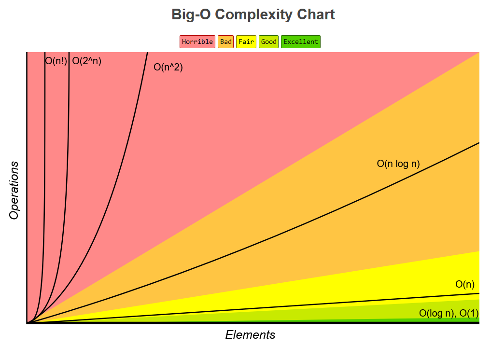

# Data Structures and Algorithms - JavaScript

## Table of Contents

1.[Big-O Notation](#big-o)
    1. [Time Complexity](#time-complexity)
       1. [O(1) Constant Time Complexity](#constant)
       2. [O(1) Constant Time Complexity](#constant)
       3. [O(1) Constant Time Complexity](#constant)
       4. [O(1) Constant Time Complexity](#constant)
       5. [O(1) Constant Time Complexity](#constant)
       6. [O(1) Constant Time Complexity](#constant)
       7. [O(1) Constant Time Complexity](#constant)
    2. [Space Complexity](#space-complexity)
    3. [The Four Rules of Big-O](#space-complexity)
    4. [Links](#space-complexity)


## Big-O Notation

A mathematical notation used in computer science to describe performance and complexity of an algorithm.



### Time Complexity

Time Complexity measures the amount of time an algorithm takes to run as a function of the input size. Focused on how the execution time increases, given the input size.

#### O(1) Constant Time Complexity

##### Definition

Algorithms with constant time complexity always take the same amount of time to execute, regardless of the size of the input. These algorithms have a fixed and predictable runtime.

##### Advantages

* **Predictable Performance:** Algorithms with constant time complexity always have the same execution time, making them **predictable** and **reliable**, regardless of input size.
* **Efficiency for Small Inputs:** Constant time complexity algorithms are ideal for operations where the input size is always a fixed number or very small, ensuring **fast execution**.
* **Optimal for Real-Time Systems:** In **real-time applications**, constant time complexity ensures that operations are completed within a fixed time frame, essential for time-sensitive tasks.

##### Disadvantages

* **Limited Applicability:** Constant time complexity algorithms are limited to specific operations and scenarios where the input size does not affect the algorithm's performance.
* **Not Suitable for Complex Problems:** Algorithms with constant time complexity cannot handle complex computational tasks or problems that require processing large datasets.
* **Difficult to Achieve:** Designing algorithms with constant time complexity is challenging and often not achievable for many real-world problems.

##### Use-Cases

**Accessing Elements in an Array or List:**

Retrieving an element from an array or list using its index. Regardless of the size of the array, accessing elements by index takes constant time because the index directly points to the memory location of the element.

```javascript
function getElementAtIndex(arr, index) {
    return arr[index];
}
```

**Checking Hash Table (HashMap) for Key-Value Pairs:**

Accessing values in a hash table (or hashmap) based on a known key. Hash tables use a hashing function to directly map keys to their corresponding values, allowing for constant time complexity for retrieval operations.

```javascript
const hashMap = {
    "key1": "value1",
    "key2": "value2",
    // ...
};

function getValueForKey(key) {
    return hashMap[key] || "Key not found";
}
```

**Operations on Fixed-Size Data Structures:**

Operations on data structures with a fixed size, such as a fixed-size array, involve constant time complexity. For example, swapping values between two variables without using additional storage takes constant time.

```javascript
function swapVariables(a, b) {
    a = a + b;
    b = a - b;
    a = a - b;
    return [a, b];
}
```

In these scenarios, the time taken for the operations remains constant regardless of the size of the input data, making algorithms with O(1) constant time complexity ideal for these use-cases.

---

#### O(n) Linear Time Complexity

##### Definition

Linear time complexity algorithms have a runtime proportional to the input size, making them suitable for small to moderate-sized datasets.

##### Advantages

* **Simplicity:** Linear time complexity algorithms are often simple to implement and understand, making them accessible for a wide range of developers.
* **Scalability:** Linear time complexity algorithms can handle larger datasets efficiently, making them suitable for moderate-sized inputs.
* **Straightforward Iteration:** Algorithms with linear time complexity often involve straightforward iterations through data structures, making them applicable to various tasks.

##### Disadvantages

* **Limited Scalability:** Linear time complexity algorithms become slow for very large datasets, as their execution time increases linearly with input size.
* **Inefficient for Complex Operations:** Algorithms with linear time complexity may not be efficient for complex computations or tasks requiring intricate data manipulations.
* **Not Suitable for Real-Time Systems:** In real-time applications where quick responses are crucial, linear time complexity algorithms might not provide the necessary speed.

##### Use-Cases

**Linear Search:**

Linear search is a straightforward algorithm for finding a target element in an unsorted list or array. It compares each element in the list with the target value until a match is found or the entire list is
traversed. Linear search has O(n) time complexity because, in the worst case, it may need to check every element in the list.

```javascript
const linearSearch = (arr, target) => {
    for (let i = 0; i < arr.length; i++) {
        if (arr[i] === target) {
            return i; // Element found at index i
        }
    }
    return -1; // Element not found in the list
}
```

**Calculating Sum of Elements:**

Calculating the sum of elements in a list or array involves iterating through each element and adding it to a total sum. As the number of elements in the input increases, the number of iterations required also
increases linearly, resulting in O(n) time complexity.

```javascript
const calculateSum(arr) => {
    let sum = 0;
    for (let num of arr) {
        sum += num;
    }
    return sum;
}
```

**Filtering Elements Based on a Condition:**

Filtering elements that meet a specific condition from a list requires iterating through the entire list. For every element, the condition is checked, and if it's met, the element is included in the output. The
time complexity is O(n) as every element in the list might need to be examined.

```javascript
const filterNumbersGreaterThan(arr, threshold) => {
    let result = [];
    for (let num of arr) {
        if (num > threshold) {
            result.push(num);
        }
    }
    return result;
}
```

In these use-cases, the algorithms' runtime grows linearly with the size of the input data, making them suitable for tasks where the number of operations scales directly with the number of elements in the input.

---

#### O(n^2) Quadratic Time Complexity

##### Definition

Algorithms with quadratic time complexity have a runtime that is proportional to the square of the input size. Nested loops iterating over the input elements are a common cause of quadratic complexity. Performance deteriorates quickly for larger inputs.

##### Advantages

* **Simplicity and Readability:**
  Quadratic algorithms are often simpler to implement and easier to understand. The straightforward nature of nested loops and simple logic can make the code more readable, which is advantageous, especially for educational purposes or in scenarios where code clarity is crucial.
* **Suitable for Small Inputs:**
  Quadratic time complexity algorithms can be suitable for small input sizes. When dealing with small datasets, the performance difference between quadratic and more efficient algorithms might not be noticeable. In such cases, choosing a simpler quadratic algorithm can save development time and effort.
* **Lack of Complexity Scaling:**
  Quadratic time complexity algorithms may not significantly impact performance when the input size is small and fixed. In situations where the input size remains constant or is limited, the performance difference between quadratic and more efficient algorithms might not be a significant concern.

##### Disadvantages

* **Inefficiency for Large Inputs:**
  Quadratic algorithms become highly inefficient as the input size increases. Their execution time grows quadratically with the input size, leading to drastically longer processing times for larger datasets. This inefficiency can make them unsuitable for real-world applications dealing with substantial amounts of data.
* **Poor Scalability:**
  Quadratic time complexity algorithms do not scale well. Even a slight increase in the input size can lead to a significant increase in the number of operations performed. As a result, these algorithms might quickly become impractical for tasks involving moderate to large-sized datasets, impacting user experience and system performance.
* **Limited Applicability:**
  Quadratic time complexity algorithms are not suitable for many real-world applications and scenarios. Tasks involving extensive data processing, searching, sorting, or complex computations typically require more efficient algorithms. Choosing quadratic algorithms in such cases can lead to suboptimal performance and may not meet the required performance standards.

##### Use-Cases

**Bubble Sort:**
Bubble Sort is a simple sorting algorithm that repeatedly steps through the list, compares adjacent elements, and swaps them if they are in the wrong order. The algorithm's time complexity is O(n^2) in the worst-case scenario, making it inefficient for large datasets. However, it can be used for educational purposes or for sorting small datasets where simplicity is preferred over efficiency.

```javascript
function bubbleSort(arr) {
    const n = arr.length;
    for (let i = 0; i < n - 1; i++) {
        for (let j = 0; j < n - i - 1; j++) {
            if (arr[j] > arr[j + 1]) {
                // Swap elements if they are in the wrong order
                [arr[j], arr[j + 1]] = [arr[j + 1], arr[j]];
            }
        }
    }
    return arr;
}
```

**Brute-Force String Matching:**
Brute-force string matching compares each character of a pattern string against each character of a text string, sliding the pattern one position at a time. This results in a quadratic time complexity (O(n^2)), making it inefficient for large texts and patterns. Brute-force matching is used when more efficient algorithms like Knuth-Morris-Pratt or Boyer-Moore are not applicable or necessary.

```javascript
function bruteForceStringMatch(text, pattern) {
    const n = text.length;
    const m = pattern.length;
    const occurrences = [];

    for (let i = 0; i <= n - m; i++) {
        let j;
        for (j = 0; j < m; j++) {
            if (text[i + j] !== pattern[j]) {
                // Character mismatch, break the inner loop
                break;
            }
        }

        if (j === m) {
            // Pattern found, add the starting index to occurrences
            occurrences.push(i);
        }
    }

    return occurrences;
}
```

**Generating Permutations:**
Generating permutations of a set involves creating all possible arrangements of the elements. One way to generate permutations is using recursive backtracking, which results in a time complexity of O(n^2) for n elements. While not the most efficient method for large sets, it's a simple approach to generate permutations for smaller sets.

```javascript
function generatePermutations(arr) {
    const permutations = [];

    function backtrack(start) {
        if (start === arr.length) {
            permutations.push([...arr]);
            return;
        }

        for (let i = start; i < arr.length; i++) {
            // Swap elements to create permutations
            [arr[start], arr[i]] = [arr[i], arr[start]];
            backtrack(start + 1);
            // Undo the swap for backtracking
            [arr[start], arr[i]] = [arr[i], arr[start]];
        }
    }

    backtrack(0);
    return permutations;
}
```

> These use-cases highlight scenarios where algorithms with quadratic time complexity can be applied, either for educational purposes, small datasets, or when more efficient algorithms are not required or available.

---

O(log n) Logaritmic Time Complexity

##### Definition

Logarithmic time complexity algorithms reduce the size of the problem in each step by a logarithmic factor. These algorithms are often found in divide and conquer strategies, and they efficiently handle large
datasets by repeatedly dividing the problem space.

##### Advantages

* **Efficiency with Large Datasets:**
  Algorithms with O(log n) time complexity are highly efficient, especially when dealing with large datasets. They scale well and can handle significant amounts of data without a significant increase in execution time. This efficiency is valuable in applications dealing with extensive data processing.
* **Efficient Searching:**
  O(log n) time complexity is commonly associated with binary search algorithms. Searching in sorted data structures (such as sorted arrays or balanced binary search trees) using binary search significantly reduces the search space in each step. This efficiency makes binary search suitable for quick retrieval of specific elements from large datasets.
* **Balanced Tree Structures:**
  O(log n) time complexity is achievable for operations like insertion, deletion, and search in balanced tree structures, such as AVL trees and Red-Black trees. These tree structures maintain balance during operations, ensuring that the height of the tree remains logarithmic, leading to efficient operations even as the dataset grows.

##### Disadvantages

* **Complexity in Implementation:**
  Implementing algorithms with O(log n) time complexity, especially those involving complex data structures like balanced trees, can be challenging. Properly maintaining the balance and ensuring logarithmic height requires careful implementation, which can lead to more complex code.
* **Limited Applicability:**
  O(log n) time complexity is not always achievable for all types of operations or data structures. It's applicable mainly to tasks like searching in sorted data structures or efficient divide and conquer algorithms. For certain tasks, finding or designing algorithms with logarithmic time complexity might not be possible.
* **Memory Overhead:**
  Some data structures that achieve O(log n) time complexity, such as balanced trees, often require additional memory to maintain their balanced structure. This memory overhead can be a disadvantage, especially in memory-constrained environments. Additionally, the overhead associated with recursive function calls in certain logarithmic algorithms can impact memory usage.

##### Use-Cases

**Binary Search:**

Binary search is a classic example of an O(log n) algorithm. It efficiently finds the position of a target element in a sorted array by repeatedly dividing the search space in half.

```javascript
function binarySearch(sortedArray, target) {
    let left = 0;
    let right = sortedArray.length - 1;

    while (left <= right) {
        let mid = Math.floor((left + right) / 2);
        if (sortedArray[mid] === target) {
            return mid; // Element found at index mid
        } else if (sortedArray[mid] < target) {
            left = mid + 1;
        } else {
            right = mid - 1;
        }
    }

    return -1; // Element not found in the array
}

// Example usage
const sortedArray = [1, 3, 5, 7, 9, 11, 13, 15];
const target = 7;
const resultIndex = binarySearch(sortedArray, target);
console.log(`Index of ${target} in the array: ${resultIndex}`);
```

**Finding Nth Fibonacci Number:**

Computing the nth Fibonacci number efficiently using matrix exponentiation techniques can achieve O(log n) time complexity.

```javascript
function matrixMultiply(matrix1, matrix2) {
    // Matrix multiplication logic
}

function power(matrix, n) {
    // Matrix exponentiation logic
}

function nthFibonacci(n) {
    const baseMatrix = [[1, 1], [1, 0]];
    const resultMatrix = power(baseMatrix, n - 1);
    return resultMatrix[0][0];
}

// Example usage
const n = 5;
const fibonacciNumber = nthFibonacci(n);
console.log(`The ${n}th Fibonacci number is: ${fibonacciNumber}`);
```

**Efficient Exponentiation:**

Calculating exponentiation efficiently using the divide and conquer method can achieve O(log n) time complexity.

```javascript
function power(base, exponent) {
    if (exponent === 0) {
        return 1;
    }
    const halfPower = power(base, Math.floor(exponent / 2));
    if (exponent % 2 === 0) {
        return halfPower * halfPower;
    } else {
        return base * halfPower * halfPower;
    }
}

// Example usage
const base = 2;
const exponent = 5;
const result = power(base, exponent);
console.log(`${base} raised to the power of ${exponent} is: ${result}`);
```

---

#### O(n log n) Linearithmic Time Complexity

##### Definition

Algorithms with linearithmic time complexity have an execution time that grows in proportion to n log ⁡n, where n**n** is the size of the input data. Many efficient sorting and searching algorithms, such as merge sort and heap sort, fall into this category.

##### Advantages

* **Efficient Sorting:**
  Algorithms with O(n log n) time complexity are often associated with **efficient sorting algorithms** like Merge Sort, Heap Sort, and QuickSort. These sorting algorithms are widely used due to their balanced performance, making them suitable for sorting large datasets efficiently.
* **Divide and Conquer Strategies:**
  Many divide and conquer algorithms achieve O(n log n) time complexity. These algorithms divide the problem into smaller subproblems, solve them independently, and then combine the solutions. This divide and conquer strategy allows for efficient processing of large datasets and is applicable to various computational problems.
* **Balanced Performance:**
  O(n log n) algorithms offer a balanced performance across a wide range of input sizes. While they are not as fast as linear algorithms (O(n)) for small datasets or constant time algorithms (O(1)) for specific operations, they provide efficient and manageable execution times for moderate to large datasets, making them versatile for various applications.

##### Disadvantages

* **Not Always Optimal:**
  O(n log n) time complexity is not always the optimal solution for all problems. For specific tasks with known input sizes or constraints, using algorithms with O(n) or even O(n^2) time complexity might be more efficient. Using O(n log n) algorithms when simpler solutions exist can result in unnecessary complexity.
* **Slower than Linear Time Algorithms for Small Inputs:**
  For small input sizes, algorithms with O(n log n) time complexity are slower than linear time algorithms (O(n)). The overhead of the divide and conquer strategy, as well as the additional comparisons and operations involved, can make O(n log n) algorithms less efficient than simpler linear algorithms when the input size is limited.
* **Higher Constant Factors:**
  O(n log n) algorithms often have higher constant factors in their execution times compared to simpler linear algorithms. This means that, even though they have a better overall growth rate than O(n^2) algorithms, they might be slower in practice for small to moderately sized datasets due to these overheads.

##### Use-Cases

**Sorting Large Datasets:**

O(n log n) sorting algorithms like Merge Sort, Heap Sort, and QuickSort are efficient for sorting large datasets. These algorithms guarantee a worst-case time complexity of O(n log n) and are widely used in various applications, such as organizing large databases, sorting files, and managing data in web applications.

```javascript
function mergeSort(arr) {
    if (arr.length <= 1) {
        return arr;
    }

    const mid = Math.floor(arr.length / 2);
    const left = mergeSort(arr.slice(0, mid));
    const right = mergeSort(arr.slice(mid));
    return merge(left, right);
}

function merge(left, right) {
    // Merge two sorted arrays logic
}

// Example usage
const unsortedArray = [5, 2, 9, 1, 5, 6];
const sortedArray = mergeSort(unsortedArray);
console.log("Sorted Array:", sortedArray);
```

**Efficient Searching in Large Datasets:**

Algorithms like Binary Search Trees (BST) or Balanced Binary Search Trees (e.g., AVL trees) maintain a sorted order, allowing efficient searching, insertion, and deletion operations in O(n log n) time complexity. These data structures are commonly used in dictionaries, databases, and various applications requiring quick search operations.

```javascript
class Node {
    constructor(value) {
        this.value = value;
        this.left = null;
        this.right = null;
    }
}

class BinarySearchTree {
    constructor() {
        this.root = null;
    }

    // BST operations (insertion, searching, deletion) logic
}

// Example usage
const bst = new BinarySearchTree();
bst.insert(5);
bst.insert(2);
bst.insert(8);
bst.insert(1);
bst.insert(3);
const found = bst.search(3);
console.log("Element 3 found:", found);
```

**Merging Multiple Sorted Lists:**

Merging multiple sorted lists efficiently can be done in O(n log k) time complexity, where k is the number of lists. This operation is useful in various applications, such as merging results from multiple search engines, combining sorted arrays from different sources, or merging sorted data from distributed systems.

```javascript
function mergeKSortedLists(lists) {
    // Merge K sorted lists logic
}

// Example usage
const sortedLists = [[1, 4, 5], [1, 3, 6], [2, 7, 8]];
const mergedList = mergeKSortedLists(sortedLists);
console.log("Merged Sorted List:", mergedList);
```

---

#### O(2^n) Exponential Time Complexity

##### Definition

Exponential time complexity algorithms have an execution time that grows exponentially with the size of the input data. These algorithms become extremely slow as the input size increases, making them impractical for most real-world applications. Recursive algorithms with branching factors fall into this category.

##### Advantages

* **Simplicity and Readability:**
  Exponential time algorithms are often simpler and easier to understand due to their straightforward recursive nature. This simplicity can make the code more readable and maintainable, especially for educational purposes or when solving small-scale problems where efficiency is not a primary concern.
* **Guaranteed Solution:**
  Exponential algorithms explore all possible combinations or subsets of a given input. This exhaustive search ensures that the algorithm finds the correct solution (if one exists) without missing any possibilities. In some cases, this exhaustive approach is necessary to guarantee correctness.
* **Useful for Small Inputs:**
  Exponential algorithms can be practical for problems with small input sizes. When the input size is limited and within reasonable bounds, exponential algorithms can provide acceptable solutions, especially if other more efficient algorithms are not available or the problem is inherently complex.

##### Disadvantages

* **Exponential Growth:**
  The execution time of exponential algorithms grows exponentially with the input size. Even a slight increase in the input size can lead to a drastic increase in the number of operations performed. This exponential growth quickly makes these algorithms impractical for larger inputs.
* **Impractical for Moderate to Large Inputs:**
  Exponential algorithms become impractical for moderate to large input sizes. As the input size increases, the number of possible combinations or subsets grows exponentially, leading to extremely long computation times. These algorithms are not suitable for real-world applications with significant amounts of data.
* **High Time Complexity Classes:**
  Exponential time complexity (O(2^n)) falls into the category of high time complexity classes. Problems belonging to such classes are considered intractable and are generally not solvable in a reasonable amount of time for large inputs. Many problems in this class are classified as NP-hard, indicating their inherent complexity.

##### Use-Cases

**Subset Generation:**

Enumerating all subsets of a given set is a classic example where an exponential time algorithm can be applied. The number of subsets of a set with n elements is 2^n. Exponential time algorithms are used to generate all possible subsets, which find applications in combinatorial problems, power set generation, and various mathematical calculations.

```javascript
function generateSubsets(set) {
    const subsets = [];
    const n = set.length;
    for (let i = 0; i < (1 << n); i++) {
        const subset = [];
        for (let j = 0; j < n; j++) {
            if (i & (1 << j)) {
                subset.push(set[j]);
            }
        }
        subsets.push(subset);
    }
    return subsets;
}

// Example usage
const inputSet = [1, 2, 3];
const allSubsets = generateSubsets(inputSet);
console.log("All Subsets:", allSubsets);

```

**Traveling Salesman Problem (TSP):**

The Traveling Salesman Problem involves finding the shortest possible route that visits a set of cities and returns to the original city. The brute-force approach to solve TSP checks all permutations of the cities, leading to an exponential time complexity. Despite its inefficiency for large datasets, this approach guarantees an optimal solution.

```javascript
function calculateTotalDistance(path, graph) {
    // Calculate total distance for the given path using graph information
}

function generateAllPermutations(cities) {
    // Generate all permutations of cities
}

function bruteForceTSP(cities, graph) {
    const permutations = generateAllPermutations(cities);
    let minDistance = Infinity;
    let optimalPath = [];

    for (const permutation of permutations) {
        const distance = calculateTotalDistance(permutation, graph);
        if (distance < minDistance) {
            minDistance = distance;
            optimalPath = permutation;
        }
    }

    return { path: optimalPath, distance: minDistance };
}

// Example usage
const cities = [1, 2, 3];
const graph = {
    1: { 2: 10, 3: 15 },
    2: { 1: 10, 3: 20 },
    3: { 1: 15, 2: 20 }
};
const result = bruteForceTSP(cities, graph);
console.log("Optimal TSP Path:", result.path);
console.log("Total Distance:", result.distance);

```

**Subset Sum Problem:**

The Subset Sum Problem involves finding a subset of a given set of positive integers that adds up to a specific target sum. The brute-force approach generates all possible subsets and checks if any subset sums up to the target value. This exhaustive search leads to an exponential time complexity but guarantees finding a valid subset if one exists.

```javascript
function calculateTotalDistance(path, graph) {
    // Calculate total distance for the given path using graph information
}

function generateAllPermutations(cities) {
    // Generate all permutations of cities
}

function bruteForceTSP(cities, graph) {
    const permutations = generateAllPermutations(cities);
    let minDistance = Infinity;
    let optimalPath = [];

    for (const permutation of permutations) {
        const distance = calculateTotalDistance(permutation, graph);
        if (distance < minDistance) {
            minDistance = distance;
            optimalPath = permutation;
        }
    }

    return { path: optimalPath, distance: minDistance };
}

// Example usage
const cities = [1, 2, 3];
const graph = {
    1: { 2: 10, 3: 15 },
    2: { 1: 10, 3: 20 },
    3: { 1: 15, 2: 20 }
};
const result = bruteForceTSP(cities, graph);
console.log("Optimal TSP Path:", result.path);
console.log("Total Distance:", result.distance);

```

---

#### O(n!) Factorial Time Complexity

##### Definition

Factorial time complexity represents algorithms whose execution time grows factorially with the size of the input data. These algorithms are extremely slow and become practically unusable for even small input sizes. Examples include brute-force algorithms generating permutations or combinations.

##### Advantages

* **Guaranteed Optimal Solution:**
  Algorithms with factorial time complexity explore all possible permutations or combinations of a given set. This exhaustive search guarantees finding the optimal solution if one exists. In many combinatorial problems, the optimal solution can be discovered by examining all permutations or combinations.
* **Simplicity and Correctness:**
  Factorial time algorithms are often simple to implement, especially for smaller inputs, as they involve iterating through all possible permutations. Additionally, due to their exhaustive nature, they ensure correctness. These algorithms are straightforward to understand and can be used as brute-force methods for small-scale problems.
* **Useful for Small Input Sizes:**
  Factorial time algorithms can be practical for problems with very small input sizes. When the input size is limited and within reasonable bounds, using factorial time algorithms might be acceptable, especially if the problem's complexity demands an exhaustive search for a complete solution.

##### Disadvantages

1. **Exponential Growth of Execution Time:**
   Factorial time complexity (O(n!)) leads to an explosion in the number of operations required as the input size increases. Even for moderately small inputs, the number of permutations becomes prohibitively large. As a result, the execution time grows at an astronomical rate, making these algorithms impractical for larger inputs.
2. **Impractical for Moderate to Large Inputs:**
   Factorial time algorithms become impractical for moderate to large input sizes. The time required to compute all permutations increases factorially, making these algorithms inefficient and slow. They quickly become unusable as the input size grows, even for relatively simple problems.
3. **Inefficiency and Limited Applicability:**
   Factorial time algorithms are generally inefficient for most real-world applications. Their inefficiency restricts their applicability to small-scale problems, and they are rarely used in production systems due to their impractical execution times. More efficient algorithms are usually preferred for solving practical problems.

##### Use-Cases

**Generating Permutations:**

Calculating all permutations of a given set is a classic use-case for O(n!) algorithms. Although inefficient, generating permutations can be useful in certain mathematical and combinatorial problems.

```javascript
function generatePermutations(inputArray) {
    if (inputArray.length <= 1) return [inputArray];
    const permutations = [];
    for (let i = 0; i < inputArray.length; i++) {
        const remainingArray = inputArray.slice(0, i).concat(inputArray.slice(i + 1));
        const partialPermutations = generatePermutations(remainingArray);
        for (const permutation of partialPermutations) {
            permutations.push([inputArray[i], ...permutation]);
        }
    }
    return permutations;
}

// Example usage
const inputArray = [1, 2, 3];
const allPermutations = generatePermutations(inputArray);
console.log("All Permutations:", allPermutations);

```

**Brute-Force Algorithm for Traveling Salesman Problem (TSP):**

A naive approach to solving the Traveling Salesman Problem (TSP) involves checking all permutations of cities to find the shortest route. Although impractical for large datasets, this brute-force method guarantees finding the optimal solution.

```javascript
function calculateTotalDistance(path, graph) {
    // Calculate total distance for the given path using graph information
}

function generateAllPermutations(cities) {
    // Generate all permutations of cities
}

function bruteForceTSP(cities, graph) {
    const permutations = generateAllPermutations(cities);
    let minDistance = Infinity;
    let optimalPath = [];

    for (const permutation of permutations) {
        const distance = calculateTotalDistance(permutation, graph);
        if (distance < minDistance) {
            minDistance = distance;
            optimalPath = permutation;
        }
    }

    return { path: optimalPath, distance: minDistance };
}

// Example usage
const cities = [1, 2, 3];
const graph = {
    1: { 2: 10, 3: 15 },
    2: { 1: 10, 3: 20 },
    3: { 1: 15, 2: 20 }
};
const result = bruteForceTSP(cities, graph);
console.log("Optimal TSP Path:", result.path);
console.log("Total Distance:", result.distance);

```

**Brute-Force Algorithm for Subset Sum Problem:**

The Subset Sum Problem involves finding a subset of a given set of positive integers that adds up to a specific target sum. One way to solve it is by checking all possible subsets (exponential time complexity). Although inefficient, this approach guarantees finding the correct subset if one exists.

```javascript
function isSubsetSum(set, n, target) {
    if (target === 0) {
        return true;
    }
    if (n === 0 && target !== 0) {
        return false;
    }
    if (set[n - 1] > target) {
        return isSubsetSum(set, n - 1, target);
    }
    return isSubsetSum(set, n - 1, target) || isSubsetSum(set, n - 1, target - set[n - 1]);
}

// Example usage
const inputSet = [3, 34, 4, 12, 5, 2];
const targetSum = 9;
const isSubsetPossible = isSubsetSum(inputSet, inputSet.length, targetSum);
console.log(`Subset with sum ${targetSum} exists: ${isSubsetPossible}`);

```

---

### Space Complexity

Space Complexity measures the amount of memory space an algorithm uses relative to the input size. Focused on how memory requirements increase, given the input size.

---

## The Four Rules in Big-O

* **Worst Case:** consider the worst case scenario (it doesn't matter if the value is found in the first interaction).
* **Remove Constants:** if I have three loops, respectively O(n + n/2 + 100), we only care when the inputs are getting larger, which leads us to O(n). Same for O(2n) --> O(n)
* **Different Terms for inputs:** if you iterate in two loops, for distinct arrays, we consider as different time complexities. Example:

```javascript
function combineArrays(arr1, arr2) {
    const combinedArray = [];

    // Loop through the first array (arr1): O(n)
    for (let i = 0; i < arr1.length; i++) {
        combinedArray.push(arr1[i]);
    }

    // Loop through the second array (arr2) O(m)
    for (let j = 0; j < arr2.length; j++) {
        combinedArray.push(arr2[j]);
    }

    return combinedArray;
}

// Example usage
const array1 = [1, 2, 3];
const array2 = [4, 5, 6];
const combined = combineArrays(array1, array2);
console.log("Combined Array:", combined); // O(n + m)

```

> In the example above, considering that each array is a different input, the result will be O(n + m).

* **Drop Non-Dominants:** consider the most relevant term in a mathematical experssion expression, dropping theless significant ones. Here is an example:

```javascript
function exampleFunction(n) {
    let quadraticTerm = 3 * n * n;  // Dominant term
    let linearTerm = 5 * n;
    let constantTerm = 2;

    let result = quadraticTerm + linearTerm + constantTerm;
    return result;
}

// Example usage
const inputSize = 10;
const output = exampleFunction(inputSize);
console.log("Output:", output);
```

> In this example, the function `exampleFunction(n)` has quadratic (n2**n****2**), linear (n**n**), and constant terms. However, when analyzing its time complexity, we focus on the dominant term (n2**n****2**) and drop the non-dominant linear and constant terms. The time complexity of this function is O(n2)**O****(****n****2****)** after dropping the non-dominant terms.

---

## Links

[Big-O Complexity Chart](https://www.bigocheatsheet.com/)

[Data Structures + Algorithms (Udemy)](https://www.udemy.com/course/master-the-coding-interview-data-structures-algorithms/)
